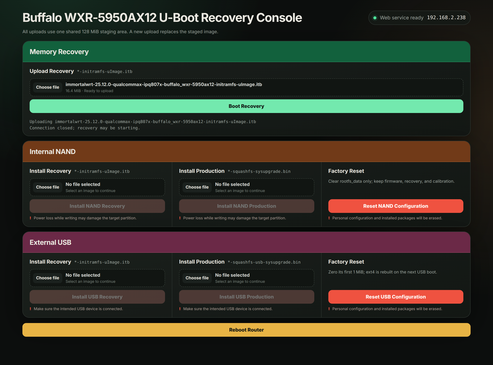

# Buffalo WXR-5950AX12 U-Boot

This is a custom U-Boot for the Buffalo WXR-5950AX12.

This project is forked from the [Qualcomm CodeLinaro QSDK U-Boot 2016 repository](https://git.codelinaro.org/clo/qsdk/oss/boot/u-boot-2016), with its upstream commit history and authorship retained.

Its features include:

- **NAND boot:** Boot either the production system or a recovery system from the router's internal NAND storage.
- **Partitioned USB boot:** Boot production or recovery images directly from their dedicated partitions on a USB storage device (using a custom WXR USB boot contract).
- **FAT USB recovery:** Find, load, validate, and start an OpenWrt initramfs recovery image from a FAT-formatted USB device.
- **TFTP recovery:** Download, validate, and start an OpenWrt initramfs recovery image from a TFTP server.
- **Web recovery:** Start the recovery interface with either a fixed IP address or an address obtained through DHCP, then upload a recovery image to memory or write supported production and recovery images to NAND or USB storage.
- **Physical boot selection:** Use the router's mode switches and Reset button to choose the default boot path; use the WPS button to enter the U-Boot console directly.
- **LED status feedback:** Use the router's multicolor LEDs to identify the selected mode and show waiting, receiving, validating, writing, success, and failure states.
- **Interactive serial menu:** Display every boot mode in a color ANSI menu with a timed default selection, keyboard navigation, reboot, and direct console access.

## Physical Boot Selection and Mode LEDs

The MODE and OP switches select the default menu entry. Holding WPS overrides every other control and enters the U-Boot console directly.

| MODE | OP | RESET | WPS | Default mode | Router LED | Internet LED | Wireless LED |
| --- | --- | --- | --- | --- | --- | --- | --- |
| Router | Auto | Released | Released | NAND production | White | Off | Off |
| Router | Auto | Held | Released | NAND recovery | Red | Off | Off |
| Router | Manual | Released | Released | USB production | Off | Off | White |
| Router | Manual | Held | Released | USB recovery | Off | Off | Red |
| AP | Auto | Either | Released | TFTP recovery | Off | White | Off |
| AP | Manual | Either | Released | FAT USB recovery | White | Off | White |
| WB | Auto | Either | Released | DHCP web recovery | Off | White | White |
| WB | Manual | Either | Released | Fixed-IP web recovery | White | White | Off |
| Any | Any | Any | Held | U-Boot console | Off | Off | Off |

- **TFTP recovery network:** The router uses `192.168.11.1/24` and connects to the TFTP server at `192.168.11.10`.
- **Fixed-IP web recovery network:** The router uses `192.168.11.1/24`. Configure the connected computer as `192.168.11.2/24`, then open `http://192.168.11.1/`.

## Power LED Status

The Power LED reports the current action independently of the three mode LEDs.

| Action state | Power LED | Meaning and timing |
| --- | --- | --- |
| Ready | Solid white | The selected mode is ready or the U-Boot console is active. |
| Waiting | Blinking white | Waiting for input; toggles every 500 ms. |
| Receiving | Fast blinking white | Receiving an image; toggles every 125 ms. |
| Validating | Alternating white and red | Validating an image; changes color every 125 ms. |
| Writing | Fast blinking red | Writing an image to NAND or USB storage; toggles every 125 ms. |
| Success | Solid white | The requested action completed successfully. |
| Failure | Solid red | The requested action failed. |

## WebUI

